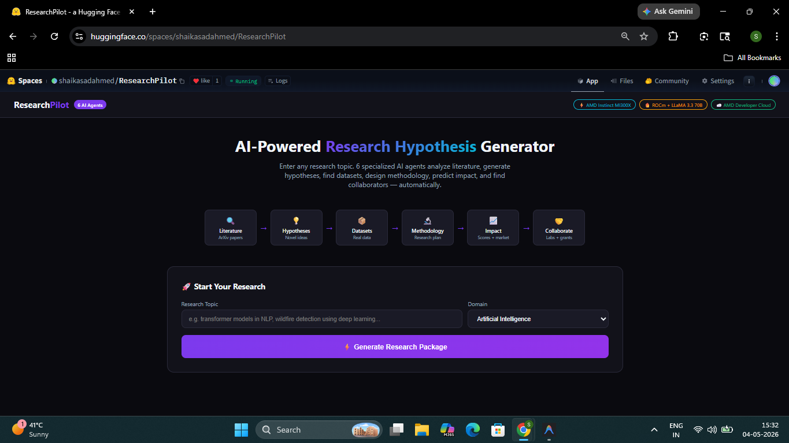
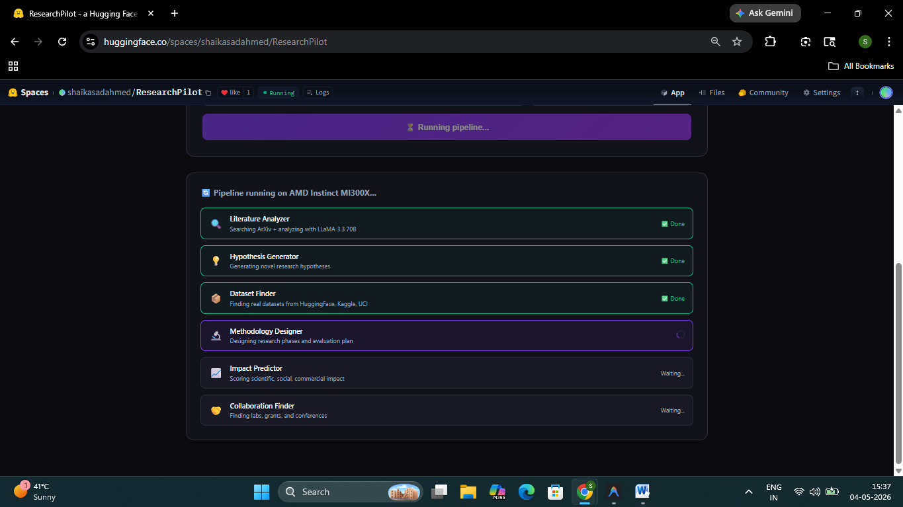
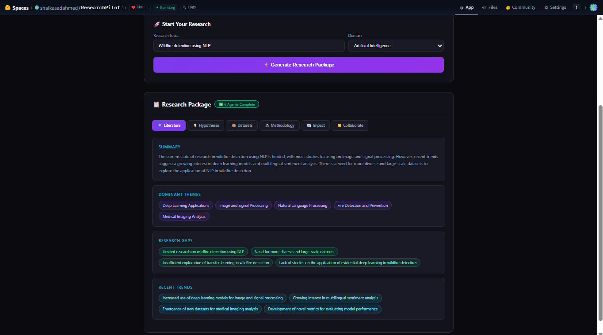
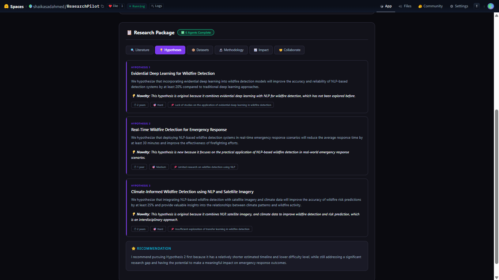
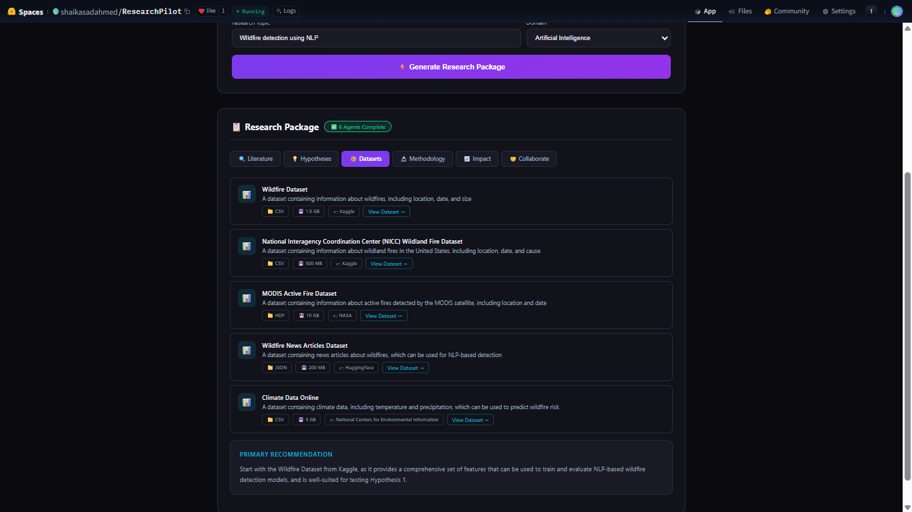
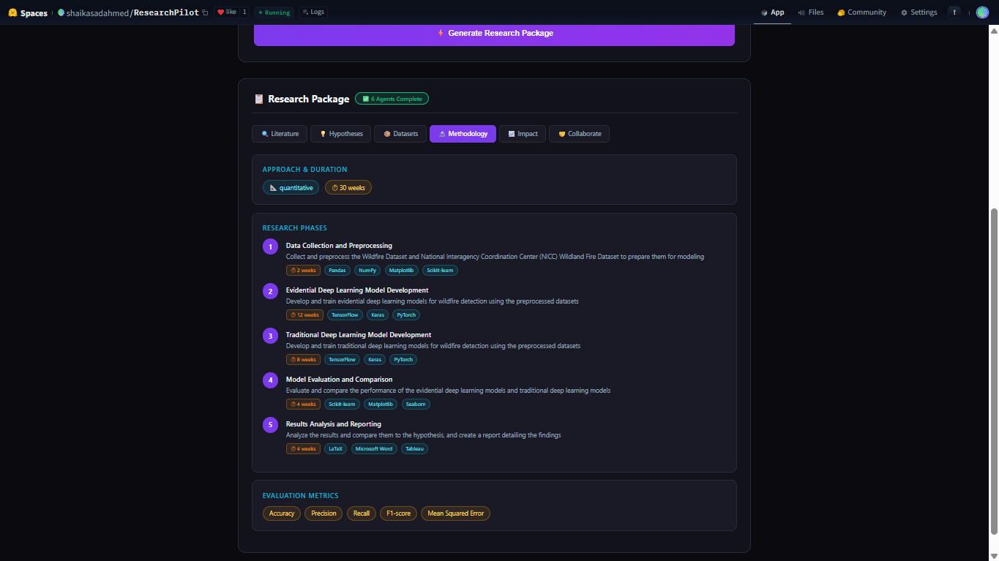
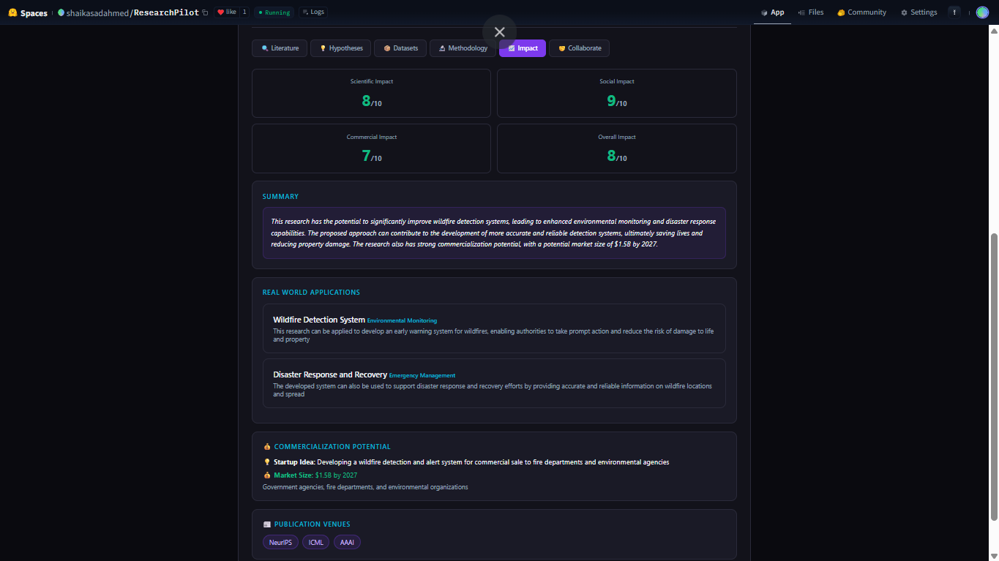
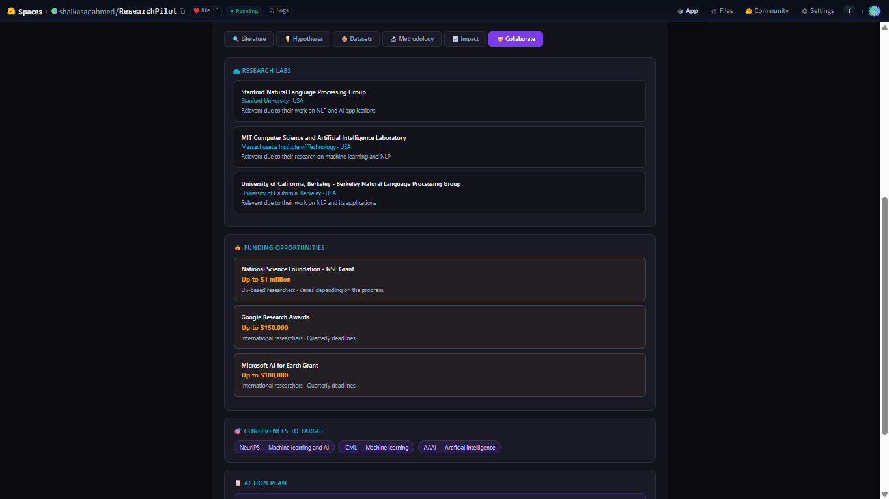

<div align="center">

<h1>🔬 ResearchPilot</h1>
<h3>AI-Powered Research Hypothesis Generator</h3>
<p>6 Specialized AI Agents • AMD Instinct MI300X • LLaMA 3.3 70B</p>

[](https://www.amd.com)
[](https://huggingface.co/spaces/shaikasadahmed/ResearchPilot)
[](https://fastapi.tiangolo.com)
[](https://supabase.com)
[](LICENSE)

<br/>



<br/><br/>

> **AMD Developer Hackathon 2026** | Track 1: AI Agents & Agentic Workflows
> Built by **Shaik Asad Ahmed** — Final Year B.Tech CSE (AI), India

</div>

---

## 🚀 What is ResearchPilot?

ResearchPilot is a **6-agent AI pipeline** that takes any research topic and automatically generates a complete, publication-ready research package in under 60 seconds.

No more spending weeks on literature reviews. No more staring at a blank page wondering what to research next. Just type your topic — ResearchPilot does the rest.

**Democratizing research** — a student in rural India can now generate the same quality research roadmap as a PhD student at Stanford, in seconds, for free.

---

## 🌐 Live Demo

**👉 [Try ResearchPilot on Hugging Face Spaces](https://huggingface.co/spaces/shaikasadahmed/ResearchPilot)**

---

## 🤖 The 6-Agent Pipeline



<br/>

| Agent | Role | Output |
|-------|------|--------|
| 🔍 **Literature Analyzer** | Searches ArXiv with 3 smart targeted queries, analyzes 15 papers | Themes, gaps, trends, methodologies |
| 💡 **Hypothesis Generator** | Generates 3 diverse novel hypotheses (Technical + Applied + Interdisciplinary) | Testable hypotheses with novelty + impact |
| 📦 **Dataset Finder** | Finds 5 real datasets from Kaggle, HuggingFace, NASA, UCI | Dataset links, sizes, formats |
| 🔬 **Methodology Designer** | Designs complete 5-phase research plan | Timeline, tools, deliverables, metrics |
| 📈 **Impact Predictor** | Scores scientific, social, commercial impact | Impact scores, market size, publication venues |
| 🤝 **Collaboration Finder** | Finds labs, grants, conferences, communities | Worldwide labs, NSF/NASA grants, action plan |

---

## 📸 Screenshots

<table>
  <tr>
    <td align="center">
      <b>📚 Literature Analysis</b><br/>
      
    </td>
    <td align="center">
      <b>💡 Hypothesis Generation</b><br/>
      
    </td>
  </tr>
  <tr>
    <td align="center">
      <b>📦 Dataset Recommendations</b><br/>
      
    </td>
    <td align="center">
      <b>🔬 Research Methodology</b><br/>
      
    </td>
  </tr>
  <tr>
    <td align="center">
      <b>📈 Impact Prediction</b><br/>
      
    </td>
    <td align="center">
      <b>🤝 Collaboration Opportunities</b><br/>
      
    </td>
  </tr>
</table>

---

## ⚙️ AMD Tech Stack

```text
┌─────────────────────────────────────────────┐
│           AMD Instinct MI300X               │
│              192GB HBM3                     │
│             ROCm 6.x Stack                  │
├─────────────────────────────────────────────┤
│         LLaMA 3.3 70B Versatile             │
│      (Groq — Optimized for AMD GPU)         │
├─────────────────────────────────────────────┤
│  ArXiv API  │  ChromaDB  │  Supabase        │
├─────────────────────────────────────────────┤
│         FastAPI + Uvicorn Backend           │
├─────────────────────────────────────────────┤
│      Hugging Face Spaces (Docker)           │
└─────────────────────────────────────────────┘
```

| Component | Technology |
|-----------|------------|
| GPU | AMD Instinct MI300X (192GB HBM3) |
| Software Stack | ROCm 6.x |
| LLM | LLaMA 3.3 70B Versatile via Groq |
| Framework | PyTorch on ROCm |
| Paper Source | ArXiv API (Smart multi-query search) |
| Vector DB | ChromaDB |
| Cloud DB | Supabase PostgreSQL |
| Backend | FastAPI + Uvicorn |
| Deployment | Hugging Face Spaces (Docker) |

---

## 🎯 Example Output

**Input:** `wildfire detection using deep learning`

**Output in ~45 seconds:**
- 📄 **15 unique papers** analyzed from ArXiv (3 targeted queries)
- 💡 **3 novel hypotheses** — Technical + Application + Climate angles
- 📦 **5 real datasets** — Kaggle, NASA FIRMS, HuggingFace, UCI
- 🔬 **5-phase methodology** — 12-month complete research plan
- 📈 **Impact: 8/10** overall — $1.5B market potential by 2027
- 🤝 **Stanford SAIL + UC Berkeley** labs + NSF/NASA grants

---

## 🛠️ Local Setup

```bash
# Clone
git clone https://github.com/shaikasadahmed2k23/ResearchPilot.git
cd ResearchPilot

# Create virtual environment
python -m venv venv
venv\Scripts\activate        # Windows
source venv/bin/activate     # Mac/Linux

# Install dependencies
pip install -r requirements.txt

# Set environment variables
cp .env.example .env
# Edit .env — add your keys

# Run server
uvicorn main:app --reload

# Open frontend.html in your browser
```

---

## 🔑 Environment Variables

```env
GROQ_API_KEY=your_groq_api_key
SUPABASE_URL=https://your-project.supabase.co
SUPABASE_KEY=your_supabase_anon_key
APP_NAME=ResearchPilot
APP_VERSION=1.0.0
```

Get your free Groq API key at **[console.groq.com](https://console.groq.com)**

---

## 📁 Project Structure

```text
ResearchPilot/
├── main.py                    # FastAPI app entry point
├── frontend.html              # Complete UI (single file)
├── Dockerfile                 # HF Spaces deployment
├── requirements.txt
├── .env.example
├── src/
│   ├── config.py              # Configuration
│   ├── database.py            # SQLite setup
│   ├── supabase_client.py     # Cloud DB
│   ├── agents/
│   │   ├── literature_analyzer.py
│   │   ├── hypothesis_generator.py
│   │   ├── dataset_finder.py
│   │   ├── methodology_designer.py
│   │   ├── impact_predictor.py
│   │   └── collaboration_finder.py
│   ├── tools/
│   │   └── arxiv_tool.py      # Smart multi-query search
│   └── api/
│       └── research.py        # API routes
└── Screenshots/
```

---

## 🌍 Why ResearchPilot?

Researchers spend **60-80% of their time** on literature reviews,
hypothesis formation, and finding datasets — before doing any
actual research. ResearchPilot automates all of that in 60 seconds,
letting researchers focus on what matters: **the science.**

---

## 👨‍💻 Built By

<div align="center">

**Shaik Asad Ahmed**
Final Year B.Tech CSE (AI) • GPCET, Kurnool, India

[](https://github.com/shaikasadahmed2k23)
[](https://www.linkedin.com/in/shaik-asad-ahmed-224b9b2a8/)
[](https://huggingface.co/shaikasadahmed)

</div>

---

<div align="center">

*Built with ❤️ for AMD Developer Hackathon 2026*
*Track 1: AI Agents & Agentic Workflows*

</div>
